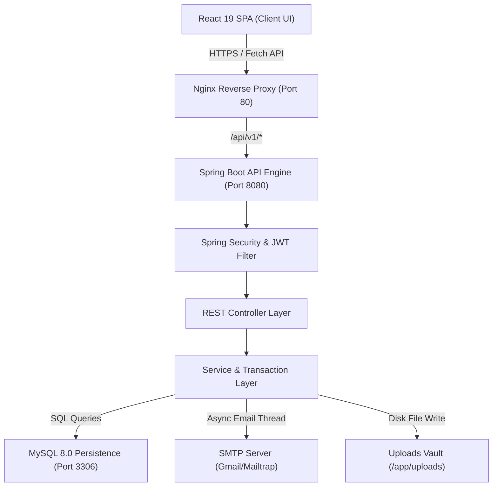
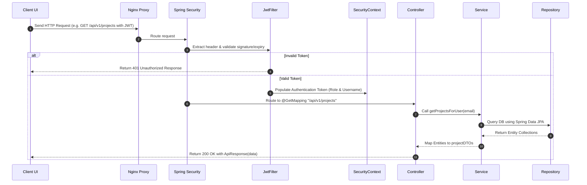
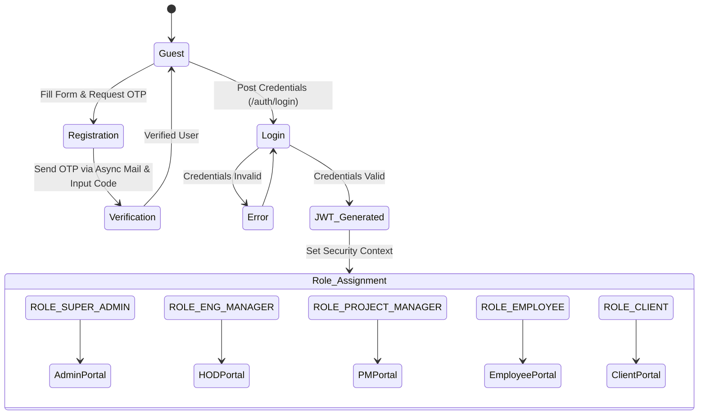
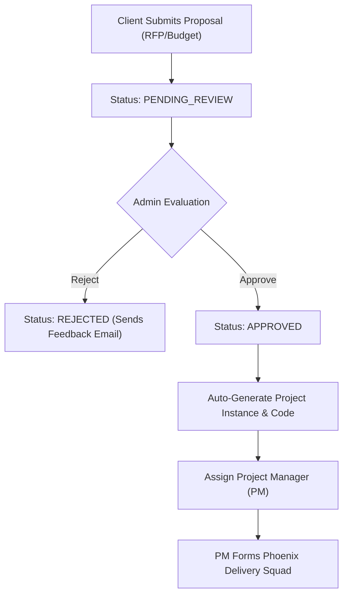
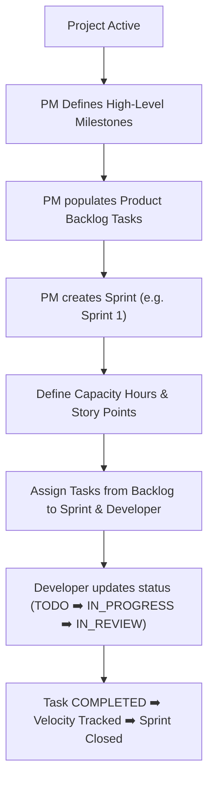
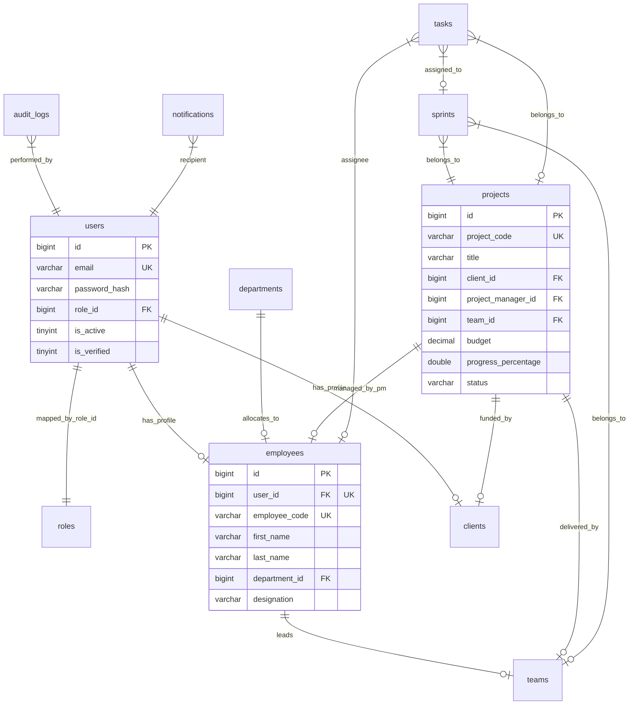

# SPEMS (Smart Project & Employee Management System)
### *Enterprise Resource Planning & Agile Collaboration Platform*

---

##  Table of Contents
1. [Project Banner & Introduction](#-spems-smart-project--employee-management-system)
2. [Why SPEMS? Business Problem & Solution](#-why-spems)
3. [Key Highlights](#-key-highlights)
4. [Detailed Features Checklist](#-detailed-features-checklist)
5. [Enterprise Portals & Personas](#-enterprise-portals--personas)
6. [System Architecture & Lifecycle Flows](#-system-architecture--lifecycle-flows)
    * [High-Level System Architecture](#1-high-level-system-architecture)
    * [End-to-End API Request Lifecycle](#2-end-to-end-api-request-lifecycle)
    * [Authentication & Authorization State Flow](#3-authentication--authorization-state-flow)
    * [Employee Management Lifecycle](#4-employee-management-lifecycle)
    * [Project Lifecycle & PM Assignment](#5-project-lifecycle--pm-assignment)
    * [Task, Sprint, & Milestone Delivery Lifecycle](#6-task-sprint--milestone-delivery-lifecycle)
7. [Technology Stack](#-technology-stack)
8. [Project Modules Deep Dive](#-project-modules-deep-dive)
9. [Enterprise Workflow Operations](#-enterprise-workflow-operations)
10. [Database Design & ER Schema](#-database-design--er-schema)
11. [Folder Structure](#-folder-structure)
12. [Installation Guide (Local Dev)](#-installation-guide)
13. [Docker Compose Deployment](#-docker-compose-deployment)
14. [Environment Variables Reference](#-environment-variables)
15. [API Overview & Documentation Catalog](#-api-overview--documentation-catalog)
16. [Demo & Sandbox Credentials](#-demo--sandbox-credentials)
17. [Postman Collection Setup](#-postman-collection-setup)
18. [Unit & Integration Testing Suite](#-unit--integration-testing-suite)
19. [Security & Performance Engineering](#-security--performance-engineering)
20. [Software Engineering Best Practices](#-software-engineering-best-practices)
21. [Screenshots & Visual Placeholders](#-screenshots--visual-placeholders)
22. [Future Roadmap](#-future-roadmap)
23. [Contributors, Support & License](#-contributors-support--license)

---

##  Why SPEMS?

### The Business Problem
In modern enterprise environments, managing multi-disciplinary engineering squads, tracking sprint capacities, maintaining transparent client communication, and monitoring financial budgets often require using fragmented tools (Jira, Excel, Email, Google Drive, Slack). This fragment leads to:
* **Information Silos**: PMs lack live capacity visibility; HODs cannot track cross-project resource utilization.
* **Security & Auditing Gaps**: Sensitive client proposals and financial budgets are stored insecurely, with no logs of who accessed or modified them.
* **Inefficient Client Collaboration**: Clients lack direct visibility into active project timelines, sprint delivery progress, and project documents.

### The Solution
**SPEMS (Smart Project & Employee Management System)** consolidates resource allocation, project tracking, and client interaction into a single, cohesive, role-governed platform. It streamlines business operations with:
* Real-time sprint capacity planning.
* Granular role-based access control (RBAC) across five specialized portals.
* Document management with upload verification.
* Live enterprise dashboard analytics and on-demand Excel/PDF financial reporting.

---

## Key Highlights
* **Clean SPA Architecture**: React 19 single-page application built with Vite and TypeScript, featuring Material UI (MUI v5) and Emotion-styled layouts.
* **Robust Spring Boot Backend**: Clean DDD (Domain-Driven Design) architecture with REST endpoints, Spring Security, Hibernate ORM, and Spring Data JPA.
* **Stateless Security**: Custom JWT filters for user authentication, method-level authorization annotation, and encrypted user credentials.
* **Asynchronous Notifications**: Outbox email notifications dispatched asynchronously using Spring Boot's task execution pool.
* **Database Persisted Audit Logging**: Built-in system logging tracking critical actions (logins, deletions, edits) with client IP mapping.

---

##  Detailed Features Checklist

*   **🔒 Authentication & Access Control**
    *   *Stateless Security:* Implementation of custom JWT authentication filters that map users to distinct security permissions.
    *   *Role-based Security (RBAC):* Secured via method-level `@PreAuthorize` security annotations.
    *   *MFA/OTP Security:* Multi-factor signup validation using 6-digit email verification codes.
    *   *Theme Preference Persistence:* Global light and dark mode toggles with immediate MUI palette updating.

*   **📁 Client Portal & Proposals**
    *   *Proposal Wizard:* A multi-step proposal form allowing corporate clients to submit RFPs, BRDs, estimated budgets, platform requirements, and compliance checklists.
    *   *Status Tracking:* Clients track proposal review status progression from `PENDING_REVIEW` to `APPROVED` or `REJECTED`.
    *   *Document Vault:* Secure uploads and downloads of project agreements, design architectures, and user documentation.

*   **📅 Agile Sprint & Backlog Board**
    *   *Sprint Planning:* Allows managers to create sprint iterations, set story point capacity goals, and assign granular tasks to team members.
    *   *Interactive Task Board:* Developers and managers use a central board to drag and drop tasks from TODO to COMPLETED.
    *   *Time & Work Logs:* Users can log daily timesheet hours spent on individual tasks.
    *   *Validation Engine:* Checks that sprint schedules stay within project timelines.

*   **📊 Financial & Progress Reporting**
    *   *Excel Data Exporters:* Generates structured, downloadable Excel spreadsheets (`.xlsx`) of projects and tasks using Apache POI.
    *   *Corporate PDF Exporter:* Generates corporate-branded PDF documents of project progress using Apache PDFBox.

*   **📬 Outbox Notification Engine**
    *   *Asynchronous Delivery:* Sends styled HTML email notifications for account creation, OTP verification, and status updates.
    *   *SMTP Performance:* Outbox mailing is delegated to Spring Boot's task execution pool using `@Async`, preventing main thread blocking.

---

## 👥 Enterprise Portals & Personas

SPEMS uses standard RBAC to adapt its dashboard interface and API access levels based on the logged-in user's role:

```
[System User]
   │
   ├──► ROLE_SUPER_ADMIN (Operations Command Center)
   │     └── Complete CRUD on users, roles, system metrics, and audit logs.
   │
   ├──► ROLE_ENG_MANAGER / ROLE_HR_MANAGER (HOD Portal)
   │     └── Departmental budgets, resource capacities, and timesheet approvals.
   │
   ├──► ROLE_PROJECT_MANAGER (Project Delivery Portal)
   │     └── Project milestones, sprint boards, risks, and task assignments.
   │
   ├──► ROLE_EMPLOYEE (Developer/QA Workspace)
   │     └── My Tasks, personal timesheet logging, and project calendar.
   │
   └──► ROLE_CLIENT (Client Collaboration Portal)
         └── Submit project proposals, upload specs, and view sprint progress charts.
```

---

## 🏗️ System Architecture & Lifecycle Flows

### 1. High-Level System Architecture
SPEMS follows a multi-tier, decoupled architecture designed for high availability and modular deployment:



### 2. End-to-End API Request Lifecycle
The diagram below illustrates the path of a secure API request from the Client to the Persistence layer and back:



### 3. Authentication & Authorization State Flow
The flowchart below maps user authentication states and portal assignment routing:



### 4. Employee Management Lifecycle
The workflow for hiring, allocating, and verifying enterprise resources:

```mermaid
graph LR
    Start["New Employee Hired"] --> AccountCreation["Admin Creates Employee Account"]
    AccountCreation --> RoleAssign["Assign Enterprise Role & Department"]
    RoleAssign --> VerifyAccount["Set Status to PENDING_VERIFICATION"]
    VerifyAccount --> SendMail["Asynchronously Dispatch Verification OTP"]
    SendMail --> SetActive["User Verifies OTP ➡️ Status: ACTIVE"]
    SetActive --> TeamAlloc["HOD/PM Allocates Employee to Team"]
```



### 5. Project Lifecycle & PM Assignment
The creation, scoping, and PM management workflow for client projects:



### 6. Task, Sprint, & Milestone Delivery Lifecycle
The agile planning loop from product backlog definition to iteration release:



---

## 🛠️ Technology Stack

| Architecture Layer | Core Technologies | Primary Use Case |
| :--- | :--- | :--- |
| **Frontend Framework** | React 19, TypeScript 5.2 | Single-page application rendering and type safety |
| **Frontend Styling** | Material UI (MUI v5), Emotion | Design templates, icons, and light/dark theme toggles |
| **State Management** | TanStack React Query v5 | Cache synchronization and asynchronous data fetching |
| **Backend Engine** | Spring Boot 3.3.0, Java 17/21 | Server business logic and REST endpoint engine |
| **Security Layer** | Spring Security 6.3, JJWT 0.12.5 | Stateless JWT authentication and endpoint guards |
| **Database ORM** | Spring Data JPA, Hibernate | Database migrations and relational persistence mapping |
| **Relational Database**| MySQL 8.0, H2 Database | Persistent storage and in-memory fallback |
| **Reporting Utilities**| Apache POI, Apache PDFBox | Excel spreadsheet downloads and PDF document exports |
| **Template Engine** | Thymeleaf 3.1 | Outbox HTML email styling |
| **Deployment & Ops** | Docker, Nginx, GitHub Actions | Containerization, routing, and CI/CD pipelines |

---

## 📦 Project Modules Deep Dive

### 1. Authentication & Security Module
*   **Purpose:** Secure gateway login and signup.
*   **Functionality:** Handles JWT generation, login verification, token refreshing, and OTP dispatching.
*   **Key APIs:** `POST /api/v1/auth/login`, `POST /api/v1/auth/register`, `POST /api/v1/auth/send-otp`.
*   **Data Flow:** Receives credentials ➡️ Encrypts password ➡️ Generates tokens ➡️ Returns Auth DTO.

### 2. Employee Profile & Resource Module
*   **Purpose:** Directory tracking and profile management.
*   **Functionality:** CRUD operations on employee profiles, department assignments, and resource utilization rates.
*   **Key APIs:** `GET /api/v1/employees`, `POST /api/v1/employees`, `PUT /api/v1/employees/{id}`.
*   **Data Flow:** Fetch profiles ➡️ Map to User database entity ➡️ Sync with frontend layout tables.

### 3. Project & Sprint Module
*   **Purpose:** Handles project delivery tracking.
*   **Functionality:** Creates projects, assigns teams, creates sprints, and defines milestones.
*   **Key APIs:** `POST /api/v1/projects`, `POST /api/v1/sprints`, `POST /api/v1/milestones`.
*   **Data Flow:** Project initiation ➡️ Team mapping ➡️ Iterative sprint backlog updates.

### 4. Meeting & Event Module
*   **Purpose:** Schedules internal and client alignment meetings.
*   **Functionality:** Registers meetings, connects them to projects/teams, and notifies participants.
*   **Key APIs:** `GET /api/v1/meetings`, `POST /api/v1/meetings`.
*   **Data Flow:** Input meeting details ➡️ Save event ➡️ Dispatches calendar notifications.

---

## 💼 Enterprise Workflow Operations

1.  **Onboarding & Proposal Review**: 
    A client submits a project proposal detailing budgets and scope via the Client Portal. The admin reviews the request, updating its status to `APPROVED`.
2.  **Project Initiation & Resource Allocation**: 
    The approved proposal automatically spawns a new Project record. A Project Manager is assigned, who then creates a Team and allocates available engineers based on their utilization capacities.
3.  **Sprint Planning**: 
    The Project Manager creates a Sprint iteration and populates it with Tasks from the backlog.
4.  **Task Execution & Time Tracking**: 
    Engineers log in to their Employee Workspace, view their assigned tasks, and update status metrics. They submit timesheets to log their actual hours worked against these tasks.
5.  **Reporting & Feedback**: 
    Managers review the project dashboard metrics and download generated PDF or Excel reports for stakeholders.

---

## 🗄️ Database Design & ER Schema

The database contains tables organized with clean referential integrity, indexes, and primary/foreign key relations.

### Relational Schema Diagram



*   **Primary Keys (PK)**: All tables use auto-incrementing `BIGINT` IDs.
*   **Foreign Keys (FK)**: Enforces referential integrity constraints across tables.
*   **Indexes**: Configured on high-frequency search columns like `users.email` and `employees.employee_code`.

---

## 📂 Folder Structure

```text
Project-Management-system-main/
├── backend/                                   # Spring Boot Java Server
│   ├── src/main/java/com/enterprise/spems/
│   │   ├── config/                            # Web Security, CORS, Seed Initialization
│   │   ├── controller/                        # REST Controllers
│   │   ├── dto/                               # Data Transfer Request/Response Models
│   │   ├── exception/                         # Global Exception Handlers
│   │   ├── model/                             # Entities and Enumerations
│   │   ├── repository/                        # JPA Repositories
│   │   ├── security/                          # JWT Logic
│   │   └── service/                           # Transactional Interfaces & Implementations
│   └── pom.xml                                # Maven Dependencies Config
├── frontend/                                  # React 19 Client Web App
│   ├── src/
│   │   ├── components/                        # Common UI Layout Widgets
│   │   ├── config/                            # Axios API Clients
│   │   ├── context/                           # Auth State Contexts
│   │   └── modules/                           # Dashboards, Sprints, Profile Components
│   └── package.json                           # NPM Dependencies Config
├── database/
│   └── schema_and_data.sql                    # Initial SQL DDL/DML script
└── docker-compose.yml                         # Docker Compose Config
```

---

## 🚀 Installation Guide

### Prerequisites
Make sure your system has these tools installed:
*   **Java JDK (17 or 21)**
*   **Apache Maven 3.8+**
*   **Node.js (v18 or higher) & NPM**
*   **MySQL Server 8.0** *(Optional: defaults to in-memory H2 database)*

---

### Step 1: Run the Spring Boot Backend
1.  Open your terminal and navigate to the backend folder:
    ```bash
    cd backend
    ```
2.  Build the Maven project:
    ```bash
    mvn clean install -DskipTests
    ```
3.  Start the application:
    ```bash
    mvn spring-boot:run
    ```
    The backend will start at **`http://localhost:8080`**.

---

### Step 2: Run the React Frontend
1.  Open a new terminal window and navigate to the frontend folder:
    ```bash
    cd frontend
    ```
2.  Install dependencies:
    ```bash
    npm install
    ```
3.  Launch the development server:
    ```bash
    npm run dev
    ```
    The React application will open at **`http://localhost:5173`**.

---

### Step 3: Database Configuration (Optional MySQL)
1. Ensure your local MySQL server is running on port `3306`.
2. Run the database setup script:
   ```bash
   mysql -u root -p < database/schema_and_data.sql
   ```
3. Modify the properties file [application-dev.yml](file:///c:/Users/RAVULA%20PAVANI/Downloads/Project-Management-system-main%20%281%29/Project-Management-system-main/backend/src/main/resources/application-dev.yml):
   ```yaml
   spring:
     datasource:
       url: jdbc:mysql://localhost:3306/spems_db?useSSL=false&serverTimezone=UTC
       username: root
       password: yourpassword
   ```

---

## 🐳 Docker Compose Deployment

The system includes a ready-to-use Docker environment.

1.  **Build and Run the Containers**:
    Run this command in the root folder containing the `docker-compose.yml` file:
    ```bash
    docker compose up --build -d
    ```
2.  **Verify Status**:
    ```bash
    docker compose ps
    ```
*   **Frontend Dashboard**: `http://localhost` (Nginx on Port 80)
*   **Backend Spring REST API**: `http://localhost:8081` (Port 8080 mapped to 8081)
*   **MySQL Database**: Runs on host Port `3307` (Container Port 3306 mapped to 3307)

---

## 🔑 Environment Variables

| Variable Name | Description | Default Value | Required |
| :--- | :--- | :--- | :--- |
| `SPRING_PROFILES_ACTIVE` | Active spring profile configuration | `dev` | Optional |
| `SPRING_DATASOURCE_URL` | JDBC database URL | `jdbc:h2:mem:spems_db` | Optional |
| `SPRING_DATASOURCE_USERNAME`| Database username credential | `sa` | Optional |
| `SPRING_DATASOURCE_PASSWORD`| Database password credential | *(empty)* | Optional |
| `JWT_SECRET` | Secret key for signing authentication tokens | `9a8b7c6d5e4f3a...` | Optional |
| `MAIL_HOST` | SMTP server address | `smtp.gmail.com` | Optional |

---

## 📋 API Overview & Documentation Catalog

Once the backend is running locally, navigate to:
*   **Interactive Swagger Playground**: `http://localhost:8080/swagger-ui.html`
*   **Raw OpenAPI JSON Specifications**: `http://localhost:8080/v3/api-docs`

### Primary REST Endpoint Catalog

| Method | Endpoint | Description | Access Role | Request Body | Response Status |
| :--- | :--- | :--- | :--- | :--- | :--- |
| `POST` | `/api/v1/auth/login` | Authenticate user credentials | Public | `LoginRequest` | `200 OK` |
| `POST` | `/api/v1/auth/register`| Register user profile | Public | `RegisterRequest` | `200 OK` |
| `GET` | `/api/v1/dashboard/metrics`| Fetch high-level project KPIs | Administrator | *(none)* | `200 OK` |
| `GET` | `/api/v1/employees` | Fetch list of employees | Employee | *(none)* | `200 OK` |
| `POST` | `/api/v1/projects` | Initialize a new project | Project Manager | `ProjectDTO` | `201 CREATED` |
| `POST` | `/api/v1/sprints` | Create a sprint iteration | Project Manager | `SprintDTO` | `201 CREATED` |
| `GET` | `/api/v1/reports/pdf` | Export project progress PDF report | Manager | *(none)* | `200 OK` |

---

## 🔑 Demo & Sandbox Credentials

| Portal / Persona | Email Address | Password |
| :--- | :--- | :--- |
| **System Super Admin** | `admin@spems.com` | `Admin@123` |
| **Head of Engineering (HOD)** | `sarah.c@spems.com` | `Admin@123` |
| **Senior Project Manager** | `alex.m@spems.com` | `Admin@123` |
| **Corporate Client** | `robert@globalbank.com` | `ClientPass@2026!` |

---

## 📬 Postman Collection Setup

An API validation run file is configured for local testing.

### How to Import and Execute:
1. Open your Postman client app and click **Import**.
2. Select your JSON collections (or use **Import Link** pointing to your local OpenAPI schema: `http://localhost:8080/v3/api-docs`).
3. Set up a Postman Environment:
   * Key: `baseUrl` ➡️ Value: `http://localhost:8080/api/v1`
   * Key: `authToken` ➡️ Value: *(Leave empty, captured from login script)*
4. In the `POST /auth/login` request, add a test script to capture the token:
   ```javascript
   var jsonData = pm.response.json();
   pm.environment.set("authToken", jsonData.data.accessToken);
   ```

---

## 🧪 Unit & Integration Testing Suite

SPEMS features an automation test suite to verify code stability.

### 1. Test Architecture
* **Unit Tests**: Employs **Mockito** to mock repository behavior and isolate service test runs.
* **Integration Tests**: Employs **MockMvc** to send HTTP requests to the controller layer and verify security filter gates offline.

### 2. How to Run the Tests:
Run this command in the backend folder:
```bash
mvn test
```

---

## 🔒 Security & Performance Engineering

### Security Architecture
* **Cryptographic Hashing**: All user passwords are encrypted using **BCrypt** with strong salt parameters before being persisted in the database database.
* **Cross-Origin Resource Sharing (CORS)**: Access is configured to allow only validated client URLs while blocking arbitrary access.
* **SQL Injection & XSS Protections**: Use of Spring Data JPA/Hibernate parameterized statements prevents SQL injections. Output data is escaped properly.
* **Method Security**: Dynamic checks using Spring Security `@PreAuthorize` are enforced on REST endpoints to verify execution scope.

### Performance Optimizations
* **Database Connection Pooling**: HikariCP is pre-configured to reuse active connections and prevent leaks.
* **TanStack Caching**: On the client UI, React Query caches fetched datasets, reducing repetitive API requests.
* **Pagination**: Heavy REST collections (like Audit Logs and Task boards) utilize Spring Data Pagination (`Pageable`) to limit server overhead.

---

## 📐 Software Engineering Best Practices

* **SOLID Principles**: Controllers delegate logic to Services, which communicate with Repositories (Single Responsibility Principle). Repositories extend JpaRepository interfaces without modification (Open/Closed Principle).
* **DRY (Don't Repeat Yourself)**: Common HTTP responses are wrapped under `ApiResponse` models. Validations use reusable validator hooks.
* **KISS (Keep It Simple, Stupid)**: Clean codebase design, minimizing complex loops or unnecessary layers.
* **YAGNI (You Aren't Gonna Need It)**: Features are designed around actual workspace workflows without adding unused, complex code blocks.

---

## 🖼️ Screenshots & Visual Placeholders

*   **Login Page**


    *   *Caption: Secure login gateway supporting multi-portal access.*
*   **Admin Dashboard**
*   

    *   *Caption: Overview panel displaying team allocations and system KPIs.*
*   **Sprint Workspace**
*   

    *   *Caption: Task lists and active sprint boards for project teams.*
*   **Client Proposal Portal**
*   

    *   *Caption: Multi-step submission wizard for project requests.*
    *       *   *Caption: Task lists and active sprint boards for project teams.*
*   **Client Proposal Portal**
*   

    *   *Caption: Multi-step submission wizard for project requests.*
    *       *   *Caption: Task lists and active sprint boards for project teams.*
*   **Client Proposal Portal**
*   

    *   *Caption: Multi-step submission wizard for project requests.*
    *       *   *Caption: Task lists and active sprint boards for project teams.*
*   **Client Proposal Portal**
*   

    *   *Caption: Multi-step submission wizard for project requests.*
    *       *   *Caption: Task lists and active sprint boards for project teams.*
*   **Client Proposal Portal**
*   

    *   *Caption: Multi-step submission wizard for project requests.*
    *       *   *Caption: Task lists and active sprint boards for project teams.*
*   **Client Proposal Portal**
*   

    *   *Caption: Multi-step submission wizard for project requests.*
    *       *   *Caption: Task lists and active sprint boards for project teams.*
*   **Client Proposal Portal**
*   

    *   *Caption: Multi-step submission wizard for project requests.*
    *       *   *Caption: Task lists and active sprint boards for project teams.*
*   **Client Proposal Portal**
*   

    *   *Caption: Multi-step submission wizard for project requests.*
    *       *   *Caption: Task lists and active sprint boards for project teams.*
*   **Client Proposal Portal**
*   

    *   *Caption: Multi-step submission wizard for project requests.*
    *       *   *Caption: Task lists and active sprint boards for project teams.*
*   **Client Proposal Portal**
*   

    *   *Caption: Multi-step submission wizard for project requests.*
    *       *   *Caption: Task lists and active sprint boards for project teams.*
    *    *   **Client Proposal Portal**
*   


    *   *Caption: Multi-step submission wizard for project requests.*
    *       *   *Caption: Task lists and active sprint boards for project teams.*
*   *   **Client Proposal Portal**
*   


    *   *Caption: Multi-step submission wizard for project requests.*
    *       *   *Caption: Task lists and active sprint boards for project teams.*

*   **Client Proposal Portal**
*   

    *   *Caption: Multi-step submission wizard for project requests.*
    *       *   *Caption: Task lists and active sprint boards for project teams.*
    *   *   **Client Proposal Portal**
*   

    *   *Caption: Multi-step submission wizard for project requests.*
    *       *   *Caption: Task lists and active sprint boards for project teams.*
    *   *   **Client Proposal Portal**
*   

    *   *Caption: Multi-step submission wizard for project requests.*
    *       *   *Caption: Task lists and active sprint boards for project teams.*
    *   *   **Client Proposal Portal**
*   blob:https://web.whatsapp.com/40375447-7fe8-4a0e-bfc8-1706c644fcf4
    *   *Caption: Multi-step submission wizard for project requests.*
    *       *   *Caption: Task lists and active sprint boards for project teams.*
   
   
    *   *Caption: Multi-step submission wizard for project requests.*


---

## 🗺️ Future Roadmap
1. **Dynamic Gantt Chart Editor**: An interactive drag-and-drop Gantt timeline chart in the project workspace portal.
2. **WebSockets Live Team Chats**: Real-time channel communications inside the project space.
3. **Advanced Timesheet Reminders**: Automated cron schedules querying unsubmitted timesheets and mailing late users.
4. **Third-Party Integrations**: Slack and Microsoft Teams hooks for task status updates.

---

## 📄 License
Distributed under the **MIT License**. See `LICENSE` for details.

