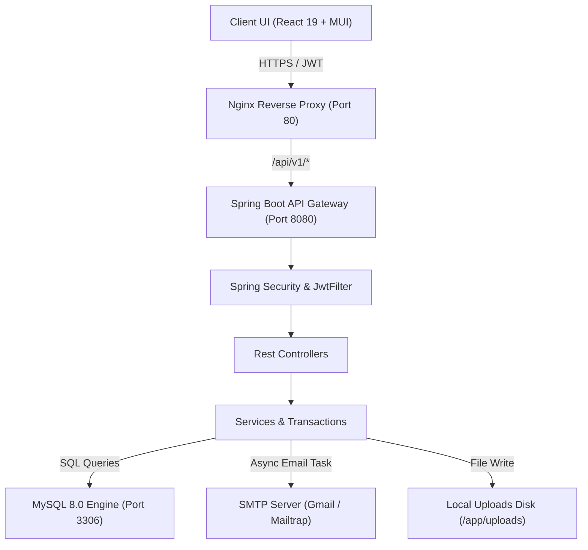
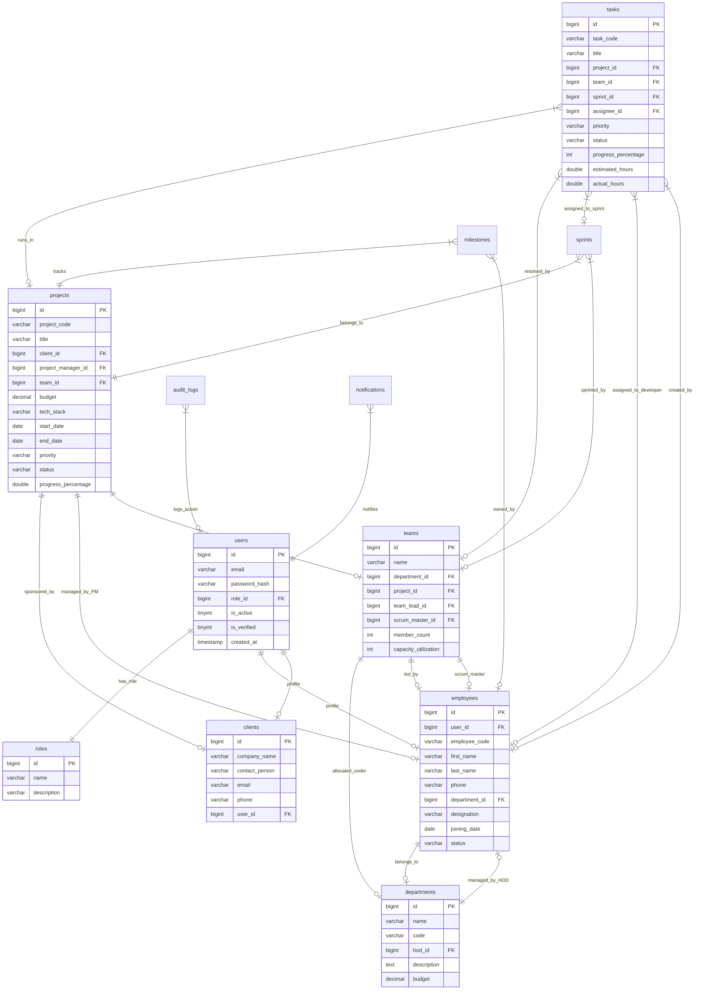
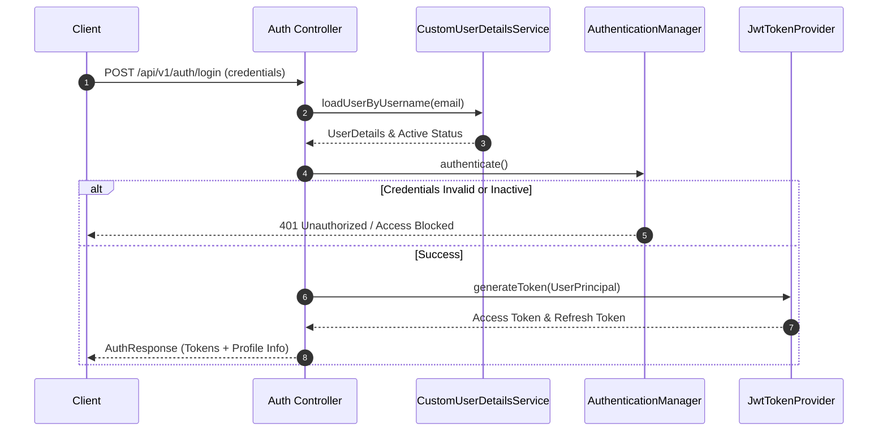
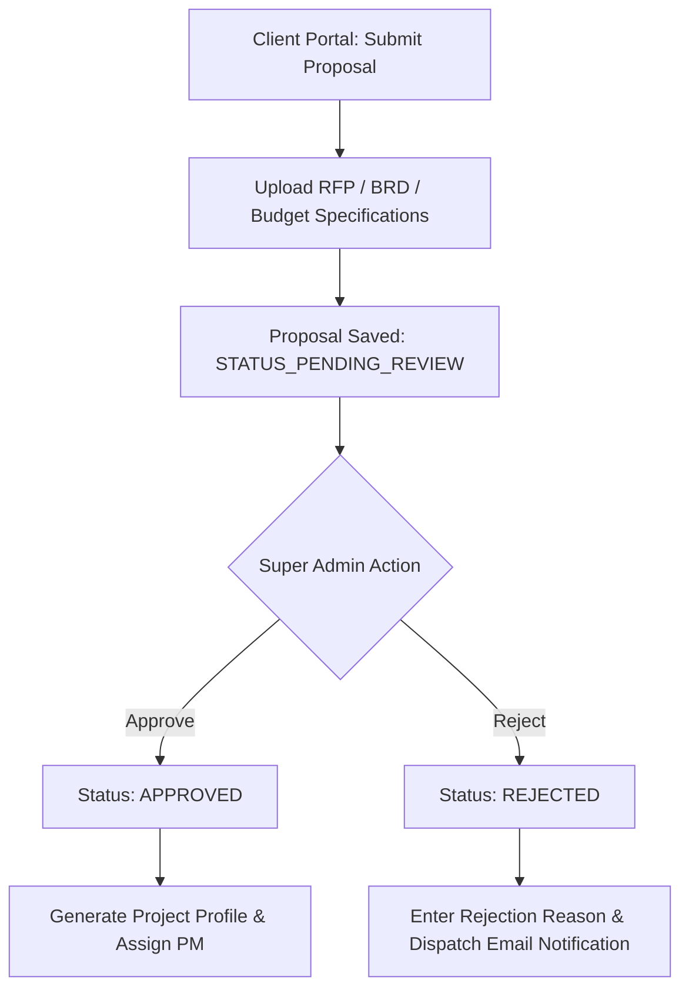

# Project-Management-system
Enterprise-grade Employee &amp; Project Management System built using React, Spring Boot, JWT, MySQL, Docker and Material UI.
# SPEMS: Smart Project & Employee Management System

SPEMS (Smart Project & Employee Management System) is an enterprise-grade, full-stack project and resource management application built using **React 19 (frontend)** with TypeScript, and **Spring Boot 3.3.0 (backend)** with Java 21 containerization and MySQL 8.0 database persistence. 

This system provides granular role-based access control across five specialized portals, automated email alerts, document management, agile sprint tracking, interactive project calendars, reporting, audit logging, and Docker Compose deployment.

---

## 1. Tech Stack Overview

| Layer | Technology / Library | Description |
| :--- | :--- | :--- |
| **Frontend Framework** | React 19, Vite 5, TypeScript 5.2 | High-performance Single Page Application (SPA) architecture with strict type safety. |
| **Frontend Styling** | Material UI (MUI v5), Emotion | Modular design system supporting dark/light mode toggles and responsive layouts. |
| **State & Data Querying** | TanStack React Query v5 | Efficient server-state synchronization, caching, and background refetching. |
| **Form Validation** | React Hook Form v7, Zod v3 | Schema-based validation enforcing real-time client-side inputs. |
| **Data Visualization** | Recharts v2 | Interactive analytics charts for dashboard metrics and resource tracking. |
| **HTTP Client & Routing** | Axios, React Router v6 | Secure API client with automatic JWT bearer interceptors and route guards. |
| **Backend Framework** | Java 17/21, Spring Boot 3.3.0 | Modern Java framework providing the REST API engine. |
| **Security & Auth** | Spring Security, JJWT (0.12.5) | Stateless authentication utilizing JWT tokens and Method Security (`@PreAuthorize`). |
| **Persistence & ORM** | Spring Data JPA, Hibernate | Automated database schema management with connection pooling. |
| **Database Engines** | MySQL 8.0 / H2 Memory DB | MySQL for production; in-memory H2 with MySQL mode compatibility for development. |
| **Reporting & Exports** | Apache POI (5.2.5), Apache PDFBox (3.0.2) | Server-side Excel (`.xlsx`) sheet generation and corporate-branded PDF exports. |
| **Mail & Notifications** | Spring Boot Mail, Thymeleaf, `@EnableAsync` | Asynchronous HTML email dispatching using template engines. |
| **API Documentation** | Springdoc OpenAPI (Swagger UI v2.5.0) | Interactive REST API testing dashboard and OpenAPI JSON specifications. |
| **Containerization** | Docker, Docker Compose | Orchestration for MySQL Database, Spring Boot API, and Nginx frontend. |
| **CI/CD Pipeline** | GitHub Actions | Automated linting, test suites execution, and container build checks. |

---

## 2. Application Screenshots & Feature Walkthrough

### 2.1 Authentication, Registration & Access Security
* **Stateless JWT Authorization**: Users log in to receive a secure JWT token, which is stored in memory and attached via request headers (`Authorization: Bearer <token>`).
* **Multi-Step Client-Side Validation**: Zod schemas enforce strict validation rules for password strength, emails, names, phone numbers, and salaries.
* **OTP & Email Verification**: Integrated email verification with OTP verification screens to validate employee identities before allowing login.
* **Theme Preference Persistence**: Global light and dark mode toggles with immediate MUI palette updating.

### 2.2 Portal Architectures & Roles

#### 2.2.1 Super Admin & Operations Command Center (`ROLE_SUPER_ADMIN`, `ROLE_ADMIN`)
* **Live System Metrics**: KPI counter cards showing active projects, total budgets, employee count, and unresolved system alerts.
* **Organization & Departments**: Hierarchical CRUD panels to manage organizational parameters, departments, HOD assignments, and office locations.
* **Employee Management**: Comprehensive team directory with sorting, pagination, and role modification capabilities.
* **Audit Logging**: Direct access to security records detailing user logins, IP addresses, modifications, and timestamps.

#### 2.2.2 Head of Department (HOD) Portal (`ROLE_ENG_MANAGER`, `ROLE_HR_MANAGER`)
* **Department Oversight**: HODs oversee department-specific budgets, team member allocations, and squad performance.
* **Timesheet & Work Reports**: Quick approvals of employee weekly timesheets and daily work log submissions.
* **Department Reporting**: Dynamic reports showing project progress, member capacity, and backlog sizes.

#### 2.2.3 Project Delivery & PM Portal (`ROLE_PROJECT_MANAGER`)
* **Sprint Backlog Manager**: Create, schedule, and close agile sprints with capacity tracking (estimated hours vs. actual hours).
* **Resource Allocation**: Match employees with roles, utilization percentages (e.g. 50% allocation), and duration dates.
* **Risk & Issue Tracking**: Create project registries for risks (LOW, MEDIUM, HIGH) and track software issues.
* **Milestone Timelines**: Gantt-style trackers representing phase completions and owner allocations.

#### 2.2.4 Employee Workspace (`ROLE_EMPLOYEE`, `ROLE_TEAM_LEAD`, `ROLE_SR_DEVELOPER`, etc.)
* **My Dashboard**: Display of assigned tasks, progress sliders, and upcoming deadlines.
* **Timesheets & Work Logs**: Input fields to submit hours spent on task cards and write daily summaries.
* **Calendar Integration**: Synchronized grid highlighting scheduled project meetings and sprint deadlines.

#### 2.2.5 Corporate Client Portal (`ROLE_CLIENT`)
* **Executive Overview**: High-level visual dashboards detailing budget consumption, active sprint status, and overall delivery metrics.
* **Project Proposals**: Multi-step request wizard allowing clients to draft, upload specs (RFP, BRD, SOW), and request project initiations.
* **Document Vault**: Secure uploads and downloads of project agreements, design architectures, and user documentation.

---

### 2.3 Data Export & Reporting Engine
* **Excel Data Sheets**: Utilizes **Apache POI** to build structured, formatted sheets (`.xlsx`) containing task and project tables.
* **Corporate PDF Reports**: Utilizes **Apache PDFBox** to compose documents complete with custom navy headers, system status summaries, and auto-wrapped grids.

### 2.4 Asynchronous HTML Email Alerts
* **Thymeleaf Template Engine**: Resolves rich HTML email content with styled cards and custom action buttons.
* **Non-Blocking Execution**: Outbox mailing is delegated to Spring Boot’s task execution pool using `@Async`, ensuring immediate frontend user responses.

---

## 3. System Flowcharts & Diagrams

### 3.1 High-Level Architecture Flowchart


### 3.2 Database Entity-Relationship (ER) Diagram


### 3.3 Authentication & OTP Verification Flowchart


### 3.4 Project Request & Proposal Sub-Flow


---

## 4. Features Checklist

* **Authentication & Authorization**
  * [x] **User Registration**: Sign up with personal data, department selections, and password patterns.
  * [x] **OTP Verification**: Multi-factor signup validation using email codes.
  * [x] **JWT Authentication**: Stateless authentication header (`Bearer <token>`) verification.
  * [x] **Role-Based Access Control**: Portals custom-fit for 5 distinct categories of business roles.
  * [x] **Method-Level Security**: Restricted Spring API endpoints using `@PreAuthorize`.
* **Client-Side Form Validation**
  * [x] **Zod Schema Compilation**: Validations matching name patterns, phone codes, and strong passwords.
  * [x] **Asynchronous Feedback Alerts**: MUI Notification toasts summarizing error/success statuses.
* **Corporate Client Portal**
  * [x] **Proposal Request Wizard**: 5-step proposal compiler with file attachment capability.
  * [x] **Document Vault**: Download structural agreements, MoUs, and wireframe documents.
* **Agile Sprint & Delivery**
  * [x] **Sprint Planner**: Create custom sprints, set goals, assign task cards, and tracking completion.
  * [x] **Resource Allocations**: Manage employee capacities, assignments, and utilization.
  * [x] **Risks & Issues Register**: Track blocker details, severity levels, and project mitigation strategies.
  * [x] **Milestone Trackers**: Visualize milestones and target due dates.
* **Audit, Logs & Operations**
  * [x] **Database Log Persistence**: Records CRUD updates, login activities, and IP details in database tables.
  * [x] **Excel and PDF Reports**: On-demand generation and downloads of structured project and task data.
  * [x] **SMTP Email Notifications**: Automated asynchronous dispatch of HTML emails upon account changes, project approvals, and task milestones.

---

## 5. Database Scripts & Schema

The SQL scripts to provision the MySQL database and load default data are stored inside the project workspace:

* **File Location**: `database/schema_and_data.sql`

### 5.1 Initial Seed Data Preview (DML)
```sql
-- Initial Roles
INSERT INTO `roles` (`id`, `name`, `description`) VALUES
(1, 'ROLE_SUPER_ADMIN', 'ROLE_SUPER_ADMIN Enterprise System Role'),
(2, 'ROLE_ADMIN', 'ROLE_ADMIN Enterprise System Role'),
(3, 'ROLE_HR_MANAGER', 'ROLE_HR_MANAGER Enterprise System Role'),
(4, 'ROLE_ENG_MANAGER', 'ROLE_ENG_MANAGER Enterprise System Role'),
(5, 'ROLE_PROJECT_MANAGER', 'ROLE_PROJECT_MANAGER Enterprise System Role'),
(6, 'ROLE_TEAM_LEAD', 'ROLE_TEAM_LEAD Enterprise System Role'),
(7, 'ROLE_SR_DEVELOPER', 'ROLE_SR_DEVELOPER Enterprise System Role'),
(8, 'ROLE_JR_DEVELOPER', 'ROLE_JR_DEVELOPER Enterprise System Role'),
(9, 'ROLE_QA_ENGINEER', 'ROLE_QA_ENGINEER Enterprise System Role'),
(10, 'ROLE_DEVOPS_ENGINEER', 'ROLE_DEVOPS_ENGINEER Enterprise System Role'),
(11, 'ROLE_EMPLOYEE', 'ROLE_EMPLOYEE Enterprise System Role'),
(12, 'ROLE_CLIENT', 'ROLE_CLIENT Enterprise System Role'),
(13, 'ROLE_INTERN', 'ROLE_INTERN Enterprise System Role');

-- Default Departments
INSERT INTO `departments` (`id`, `name`, `code`) VALUES
(1, 'Engineering & Technology', 'ENG'),
(2, 'Human Resources', 'HR'),
(3, 'Project Management Office', 'PMO'),
(4, 'Quality Assurance', 'QA');
```

---

## 6. Project Structure

```text
Project-Management-system-main/
├── .github/
│   └── workflows/
│       └── ci-cd.yml
├── backend/
│   ├── src/main/java/com/enterprise/spems/
│   │   ├── config/
│   │   │   ├── DataInitializer.java
│   │   │   └── SecurityConfig.java
│   │   ├── controller/
│   │   │   ├── AuditLogController.java
│   │   │   ├── AuthController.java
│   │   │   ├── ClientController.java
│   │   │   ├── DashboardController.java
│   │   │   ├── DepartmentController.java
│   │   │   ├── DocumentController.java
│   │   │   ├── EmployeeController.java
│   │   │   ├── MeetingController.java
│   │   │   ├── MilestoneController.java
│   │   │   ├── NotificationController.java
│   │   │   ├── ProjectController.java
│   │   │   ├── ProjectRequestController.java
│   │   │   ├── ReportController.java
│   │   │   ├── ResourceAllocationController.java
│   │   │   ├── RiskController.java
│   │   │   ├── SprintController.java
│   │   │   ├── TaskController.java
│   │   │   ├── TeamController.java
│   │   │   └── TimesheetController.java
│   │   ├── dto/
│   │   │   ├── request/
│   │   │   │   ├── CreateEmployeeRequest.java
│   │   │   │   ├── LoginRequest.java
│   │   │   │   ├── RefreshTokenRequest.java
│   │   │   │   └── RegisterRequest.java
│   │   │   └── response/
│   │   │       ├── AuthResponse.java
│   │   │       └── EmployeeDTO.java
│   │   ├── model/
│   │   │   ├── entity/
│   │   │   │   ├── AuditLog.java
│   │   │   │   ├── Client.java
│   │   │   │   ├── Department.java
│   │   │   │   ├── Employee.java
│   │   │   │   ├── FileAttachment.java
│   │   │   │   ├── Meeting.java
│   │   │   │   ├── Milestone.java
│   │   │   │   ├── Notification.java
│   │   │   │   ├── Project.java
│   │   │   │   ├── ProjectProposal.java
│   │   │   │   ├── RefreshToken.java
│   │   │   │   ├── ResourceAllocation.java
│   │   │   │   ├── Role.java
│   │   │   │   ├── Sprint.java
│   │   │   │   ├── Task.java
│   │   │   │   ├── TaskComment.java
│   │   │   │   ├── Team.java
│   │   │   │   ├── TeamMember.java
│   │   │   │   └── User.java
│   │   │   └── enums/
│   │   │       ├── EmployeeStatus.java
│   │   │       ├── PriorityLevel.java
│   │   │       ├── ProjectStatus.java
│   │   │       ├── RoleType.java
│   │   │       └── TaskStatus.java
│   │   ├── repository/
│   │   │   ├── AuditLogRepository.java
│   │   │   ├── ClientRepository.java
│   │   │   └── ...
│   │   ├── security/
│   │   │   ├── CustomUserDetailsService.java
│   │   │   ├── JwtAuthenticationFilter.java
│   │   │   └── ...
│   │   └── service/
│   │       ├── impl/
│   │       └── storage/
│   ├── Dockerfile
│   └── pom.xml
├── frontend/
│   ├── src/
│   │   ├── components/
│   │   │   ├── common/
│   │   │   └── layout/
│   │   │       ├── Sidebar.tsx
│   │   │       └── Header.tsx
│   │   ├── config/
│   │   │   ├── axios.config.ts
│   │   │   └── routes.config.tsx
│   │   ├── context/
│   │   ├── modules/
│   │   │   ├── audit/
│   │   │   ├── auth/
│   │   │   ├── client/
│   │   │   ├── dashboard/
│   │   │   ├── department/
│   │   │   ├── employees/
│   │   │   ├── meeting/
│   │   │   ├── project/
│   │   │   ├── report/
│   │   │   ├── settings/
│   │   │   └── task/
│   │   ├── App.tsx
│   │   └── main.tsx
│   ├── Dockerfile
│   ├── nginx.conf
│   └── package.json
├── database/
│   └── schema_and_data.sql
└── docker-compose.yml
```

---

## 7. Prerequisites & Setup Instructions

### Option A: Docker Compose (Recommended)
This is the simplest way to deploy the entire multi-container architecture. Make sure Docker Desktop is active.

1. **Clone the Repository & Navigate to Workspace**:
   ```bash
   git clone <repository_url>
   cd Project-Management-system-main/Project-Management-system-main
   ```
2. **Build and Run Containers**:
   ```bash
   docker compose up --build -d
   ```
3. **Verify running containers**:
   ```bash
   docker compose ps
   ```
   * **Frontend Portal**: `http://localhost` (Nginx mapping on Port 80)
   * **Spring Backend REST API**: `http://localhost:8081` (Mapping container Port 8080 to host Port 8081)
   * **MySQL Server**: Running on host Port `3307` (Mapping container Port 3306 to host Port 3307)

---

### Option B: Local Manual Setup

#### Step 1: Prepare Database Server
Ensure MySQL 8.0/8.4 is active on port `3306`. Run the schema provisioning script:
```bash
mysql -u root -p < database/schema_and_data.sql
```
*Alternatively, you can let Spring Boot Hibernate auto-generate tables by running H2 in-memory or adjusting application properties.*

#### Step 2: Configure Environment & Mail API (backend/src/main/resources/application-dev.yml)
Adjust development variables as necessary:
```yaml
spring:
  datasource:
    url: jdbc:mysql://localhost:3306/spems_db?useSSL=false&serverTimezone=UTC
    username: root
    password: yourpassword
  mail:
    host: smtp.gmail.com
    port: 587
    username: your_sender_email@gmail.com
    password: your_app_password
```

#### Step 3: Run Spring Boot Backend Application
```bash
cd backend
mvn clean install
mvn spring-boot:run
```
* The API server starts on **Port 8080** by default.

#### Step 4: Run Vite + React 19 Frontend Web Portal
```bash
cd ../frontend
npm install
npm run dev
```
* The React client starts on **Port 5173** by default.

---

## 8. Sandbox & Demo Credentials

These records are automatically loaded into the database during startup if database seed parameters are empty (configured in `DataInitializer.java`):

| Portal / Role | Email | Password | Assigned Designation |
| :--- | :--- | :--- | :--- |
| **System Super Admin** | `admin@spems.com` | `Admin@123` | Principal Enterprise Administrator |
| **Head of Engineering** | `sarah.c@spems.com` | `Admin@123` | Head of Engineering & Technology |
| **Senior Project Manager** | `alex.m@spems.com` | `Admin@123` | Senior Project Manager |
| **Corporate Client** | `robert@globalbank.com` | `ClientPass@2026!` | Global Bank Corp Representative |

---

## 9. Interactive API Documentation

When the backend Spring Boot server is running, you can access the OpenAPI Swagger interface directly:

* **Interactive Swagger UI**: `http://localhost:8080/swagger-ui.html`
* **Raw OpenAPI Specification (JSON)**: `http://localhost:8080/v3/api-docs`

---

## 10. Submission & Author Info

* **Developer**: Ravula Pavani
* **Project Reference**: Developed as part of an Advanced Enterprise Web Systems architecture portfolio.
* **License**: MIT License

