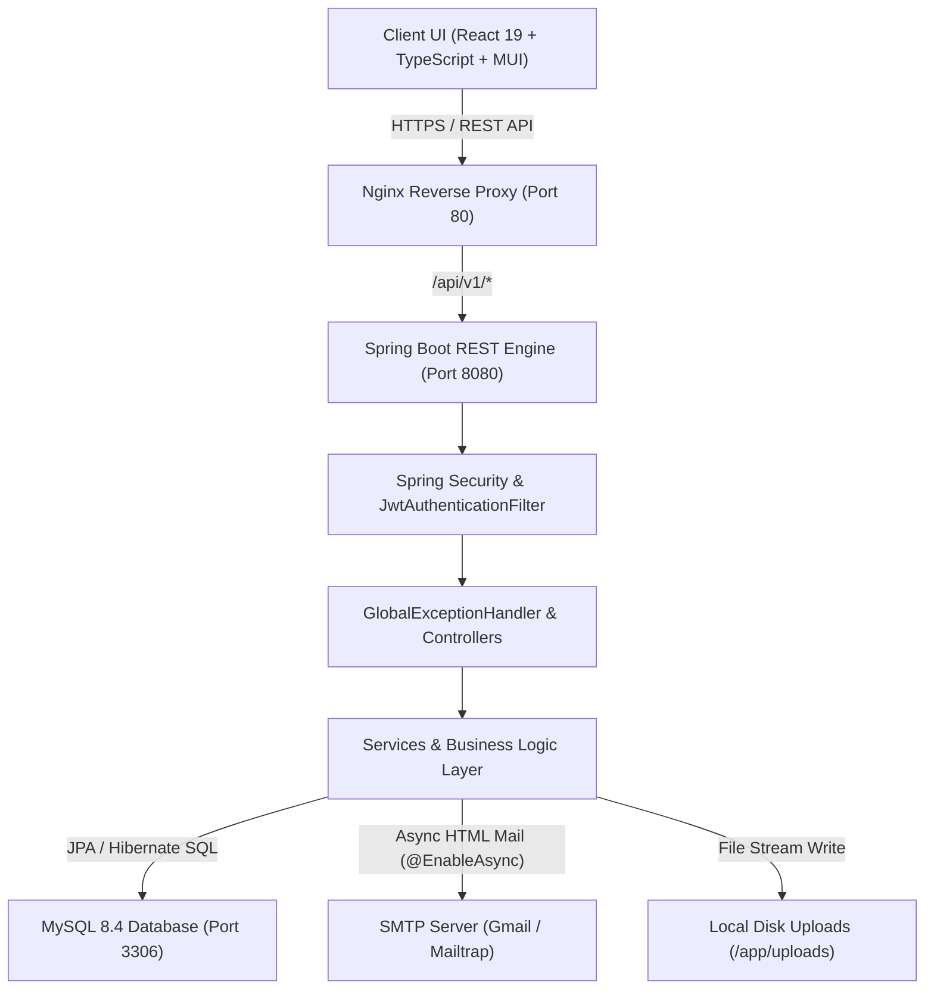
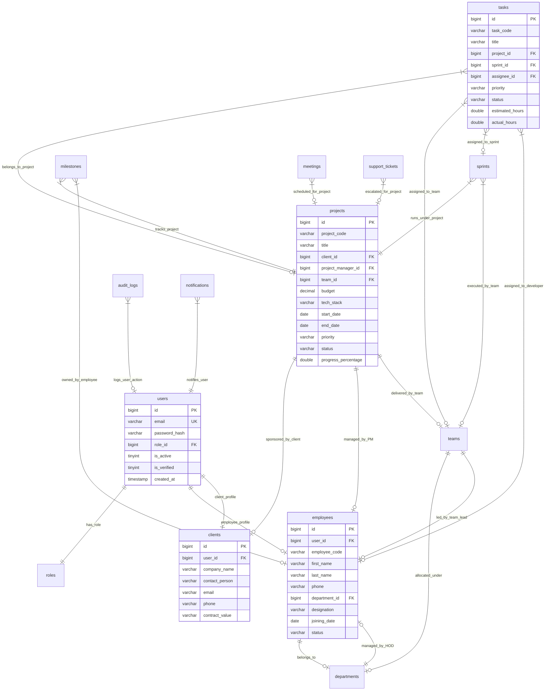
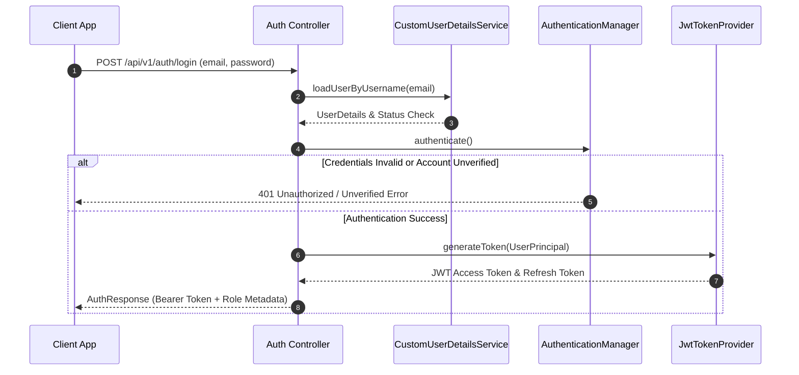
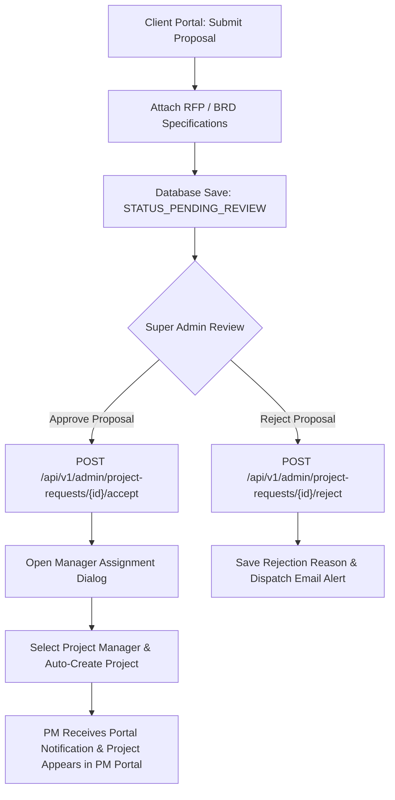
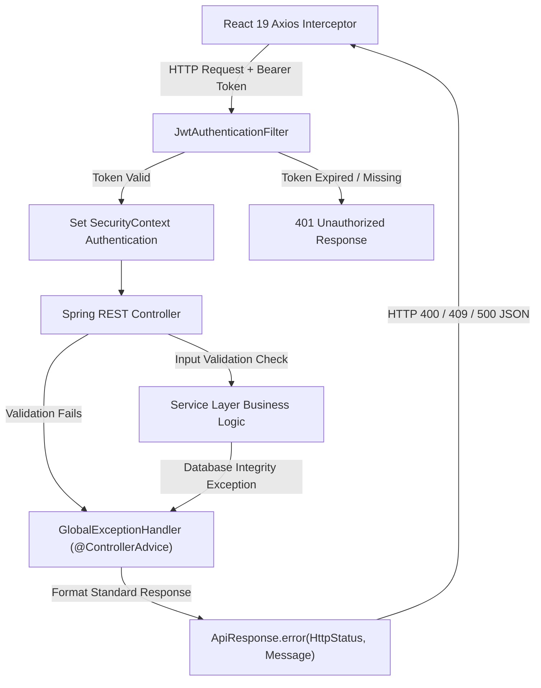

# SPEMS Enterprise: Smart Project & Employee Management System

**SPEMS Enterprise** (Smart Project & Employee Management System) is a production-grade, full-stack enterprise web application built using **React 19 (frontend)** with TypeScript, **Spring Boot 3.3.0 (backend)** with Java 21 containerization, and **MySQL 8.4** database persistence.

The application delivers end-to-end enterprise resource planning, agile project delivery, corporate client proposal management, role-based meeting scheduling, multi-factor OTP verification, automated asynchronous email dispatches, dual PDF/CSV reporting, audit logging, and global form validation.

---

## 1. Tech Stack Overview

| Layer | Technology / Library | Description |
| :--- | :--- | :--- |
| **Frontend Framework** | React 19, Vite 5, TypeScript 5.2 | High-performance Single Page Application (SPA) with strict type safety. |
| **Frontend UI & Styling** | Material UI (MUI v5), Emotion | Modular design system supporting dark/light mode toggles and responsive layouts. |
| **State & Data Querying** | TanStack React Query v5 | Server-state synchronization, caching, and background refetching. |
| **Form Validation** | React Hook Form v7, Zod v3 | Schema-based validation enforcing real-time client-side inputs across all forms. |
| **Data Visualization** | Recharts v2 | Interactive analytics charts for dashboard metrics, team workload, and KPI tracking. |
| **HTTP Client & Routing** | Axios, React Router v6 | Secure API client with automatic JWT bearer interceptors and role-based route guards. |
| **Backend Framework** | Java 21, Spring Boot 3.3.0 | Enterprise Java framework powering the REST API engine. |
| **Security & Auth** | Spring Security, JJWT (0.12.5) | Stateless authentication with JWT tokens and Method Security (`@PreAuthorize`). |
| **Persistence & ORM** | Spring Data JPA, Hibernate | Database access layer with automated schema management and connection pooling. |
| **Database Engine** | MySQL 8.4 / 8.0 | Relational database persistence with foreign key integrity and schema seeding scripts. |
| **Reporting & Exports** | Apache POI (5.2.5), OpenPDF / iText | Server-side Excel (`.xlsx`) sheet generation and corporate-branded PDF exports (`/api/v1/reports/pdf`). |
| **Mail & Notifications** | Spring Boot Mail, Thymeleaf, `@EnableAsync` | Non-blocking asynchronous HTML email dispatches for OTP, approvals, and alerts. |
| **API Documentation** | Springdoc OpenAPI (Swagger UI v2.5.0) | Interactive REST API testing interface and OpenAPI JSON specification. |
| **Containerization** | Docker, Docker Compose | Multi-container orchestration (MySQL Database, Spring Boot API, NGINX Web Server). |
| **Testing & Quality** | JUnit 5, Mockito, Spring Boot Test | Comprehensive unit, integration, and REST controller test suites. |

---

## 2. Application Screenshots & Feature Walkthrough

### 2.1 Authentication, Multi-Factor OTP & Access Security
* **Stateless JWT Authorization**: Users log in to receive a secure JWT token attached via request headers (`Authorization: Bearer <token>`).
* **Multi-Factor 6-Digit Email OTP**: Registration triggers a 6-digit OTP dispatched via Spring Mail SMTP to verify real user email addresses before granting portal access (`OTPVerificationPage.tsx`).
* **Enterprise Form Validation**: Real-time email regex matching, password strength checks (min 6 characters), and inline helper text error indicators across all authentication forms (`LoginPage.tsx`, `RegisterPage.tsx`, `ForgotPasswordPage.tsx`, `ResetPasswordPage.tsx`).

### 2.2 Portal Architectures & Specialized Business Personas

#### 2.2.1 Super Admin & Operations Command Center (`ROLE_SUPER_ADMIN`, `ROLE_ADMIN`)
* **Live System Metrics**: KPI counter cards tracking active corporate projects, total contracted budgets, overall headcount, and active department counts.
* **Employee Lifecycle Management**: 4-Step Add Employee Wizard (`AddEmployeeWizardModal.tsx`), Edit Employee modal, Department Transfer modal (`TransferDepartmentModal.tsx`), and Project Assignment dialogs (`AssignProjectDialogModal.tsx`).
* **Corporate Client & Proposal Onboarding**: Client Onboarding dialog, Project Proposal Review Vault (accept/reject proposals, inspect RFP/BRD PDF document attachments, assign designated Project Managers).
* **Enterprise Department Management**: 5-Step Add Department Wizard (`AddDepartmentWizardModal.tsx`), Assign Head of Department (HOD) modal (`AssignDepartmentHeadModal.tsx`), Edit Department modal (`EditDepartmentModal.tsx`), annual budget tracking, and cost centers.
* **Compliance & Audit Logging**: Global Audit Trail (`AuditLogListPage.tsx`) logging user activity, timestamps, IP addresses, and operational actions with direct CSV export (`/api/v1/admin/audit-logs/export`).

#### 2.2.2 Head of Department (HOD) Portal (`ROLE_ENG_MANAGER`, `ROLE_HR_MANAGER`)
* **Department Oversight**: Department-specific budget management, squad capacity tracking, and member performance monitoring.
* **Timesheet & Work Log Approvals**: Review and approve employee weekly timesheet submissions and daily work hour entries.

#### 2.2.3 Project Delivery & PM Portal (`ROLE_PROJECT_MANAGER`)
* **Agile Sprint & Backlog Manager**: Create, schedule, and execute sprints with capacity hours, story points, date validation (`endDate >= startDate`), and Kanban board integration (`CreateSprintModal.tsx`).
* **Milestone Timelines**: Track phase completions, due dates, and milestone owners (`CreateMilestoneModal.tsx`).
* **Resource Allocation Engine**: Match developers to projects based on primary skill, availability percentage, and workload capacity.
* **Role-Based Meeting Scheduler**: Schedule role-restricted meetings with Google Meet / Teams links, dynamic participant multi-selection, and time validation (`endTime > startTime`) (`EnterpriseScheduleMeetingModal.tsx`).

#### 2.2.4 Employee Workspace (`ROLE_EMPLOYEE`, `ROLE_TEAM_LEAD`, `ROLE_SR_DEVELOPER`)
* **My Task Board**: Status lifecycle management (`PENDING` $\rightarrow$ `IN_PROGRESS` $\rightarrow$ `COMPLETED`), priority flags (`LOW`, `MEDIUM`, `HIGH`, `CRITICAL`), and deadline countdowns.
* **Timesheet & Work Hours Record**: Log daily task hours with strict validation (0.5 to 24 hours per day) and submit weekly timesheets for Tech Lead and PM approval (`TimesheetPage.tsx`).
* **Issue & Bug Escalation**: Report production bugs and technical queries (`IssueListPage.tsx`).

#### 2.2.5 Corporate Client Portal (`ROLE_CLIENT`)
* **Client Portal Dashboard**: High-level visual metrics detailing active project progress, budget consumption, and delivery milestones.
* **Project Proposal Submission**: Proposal Request Wizard allowing clients to submit project titles, target budgets, expected start dates, and multi-document specs (RFP, BRD, SOW file attachments) (`RequestProjectModal.tsx`).
* **Dynamic Meetings Hub**: View scheduled syncs with Project Managers and technical leads with 1-click Join links.
* **Support Ticket Escalation**: Raise support tickets and production incident alerts directly to assigned Project Managers (`RaiseSupportTicketModal.tsx`).

### 2.3 Reporting & Data Export Engine
* **Excel Data Sheets**: Structured Excel-compatible CSV exports for Audit Logs, Employees, Projects, and Timesheets.
* **Executive PDF Exporter**: Server-side branded PDF document generation featuring custom headers, system metrics, and formatted data tables (`/api/v1/reports/pdf?title=...`).

### 2.4 Asynchronous HTML Email Notifications
* **Non-Blocking Execution**: Outbox mailing is executed asynchronously via Spring Boot's `@EnableAsync` thread pool, ensuring zero UI blocking during email dispatch.

---

## 3. System Flowcharts & Diagrams

### 3.1 High-Level Architecture Flowchart


### 3.2 Database Entity-Relationship (ER) Diagram


### 3.3 Authentication & Authorization Flowchart


### 3.4 Client Proposal -> PM Assignment Flowchart


### 3.5 End-to-End REST API Exception Handling Lifecycle


---

## 4. Features Checklist & System Capabilities

* **Authentication & Authorization**
  * [x] **User Registration**: Sign up with personal details, organization, and persona role.
  * [x] **6-Digit Gmail OTP**: Multi-factor signup verification via Spring Mail.
  * [x] **Stateless JWT Security**: Token-based access with `@PreAuthorize` method security.
  * [x] **5 Portal Persona Guarding**: Custom navigation for Super Admin, HOD, PM, Employee, and Client.
* **Enterprise Form Validation & Exception Handling**
  * [x] **Comprehensive Client Validation**: Strict pattern checks for email regex, passwords (min 6 chars), dates, and numbers.
  * [x] **Centralized Exception Handler**: `GlobalExceptionHandler.java` translating `DataIntegrityViolationException`, `IllegalArgumentException`, and validation errors into friendly `ApiResponse.error()` JSON.
* **Corporate Client Portal**
  * [x] **Proposal Submission**: Project request wizard with RFP/BRD specification file attachments.
  * [x] **Dynamic Meetings**: Real-time syncs with PMs and engineers with 1-click Join links.
  * [x] **Support Incident Escalations**: Raise critical support tickets directly to assigned Project Managers.
* **Agile Sprint & Delivery Management**
  * [x] **Sprint Planner**: Create sprints, configure capacity hours, story points, and validate date ranges (`endDate >= startDate`).
  * [x] **Milestone Tracking**: Phase completions, target due dates, and milestone owners.
  * [x] **Resource Allocation**: Balance team member utilization percentages and skills.
* **Audit, Reporting & Operations**
  * [x] **Database Audit Logging**: Capture logins, transfers, proposals, and updates in `audit_logs` table with CSV export.
  * [x] **Excel & PDF Exports**: Download structured project, task, and timesheet reports on demand.
  * [x] **Asynchronous Email Dispatches**: HTML email notifications sent via `@EnableAsync` for non-blocking UI.

---

### 4.1 Unit & Integration Testing Suite

The SPEMS Enterprise repository incorporates a full-coverage automated testing architecture across both backend and frontend layers:

| Test Layer | Technologies / Frameworks | Coverage Scope | Execution Command |
| :--- | :--- | :--- | :--- |
| **Backend Services** | JUnit 5, Mockito | Service business logic, JPA repository mocks, security validation | `cd backend && mvn test` |
| **Backend Controllers** | Spring Boot Test, MockMvc | REST endpoints, HTTP status codes, payload serialization, RBAC gates | `cd backend && mvn test` |
| **Backend Data Layer** | `@DataJpaTest`, H2 / MySQL | Custom JPA query execution, entity constraints, foreign keys | `cd backend && mvn test` |
| **Frontend UI Testing** | Vitest / RTL, React Testing Library | Component rendering, state updates, form validation triggers | `cd frontend && npm test` |

#### Running Backend & Frontend Test Suites

1. **Execute Backend Tests**:
   ```bash
   cd backend
   mvn clean test
   ```
2. **Execute Frontend Tests**:
   ```bash
   cd frontend
   npm test
   ```

---

## 5. Database Scripts & Schema

The SQL provisioning scripts for initializing the MySQL database schema and populating initial seed records are maintained in the repository:

* **File Path**: `database/schema_and_data.sql`

### 5.1 Initial Seed Data Preview (DML)
```sql
-- Initial System Roles
INSERT INTO `roles` (`id`, `name`, `description`) VALUES
(1, 'ROLE_SUPER_ADMIN', 'Super Administrator Role'),
(2, 'ROLE_ADMIN', 'System Administrator Role'),
(3, 'ROLE_ENG_MANAGER', 'Engineering Department Manager Role'),
(4, 'ROLE_HR_MANAGER', 'Human Resources Manager Role'),
(5, 'ROLE_PROJECT_MANAGER', 'Project Manager Role'),
(6, 'ROLE_TEAM_LEAD', 'Team Lead Role'),
(7, 'ROLE_EMPLOYEE', 'Software Employee Role'),
(8, 'ROLE_CLIENT', 'Corporate Client Role');

-- Default Enterprise Departments
INSERT INTO `departments` (`id`, `name`, `code`, `annual_budget`) VALUES
(1, 'Core Engineering & Technology', 'ENG', 1200000.00),
(2, 'Human Capital & HR', 'HR', 450000.00),
(3, 'Project Management Office', 'PMO', 750000.00),
(4, 'Quality Assurance & Testing', 'QA', 350000.00);

-- Initial Enterprise Accounts
INSERT INTO `users` (`id`, `email`, `password_hash`, `role_id`, `is_active`, `is_verified`, `created_at`) VALUES
(1, 'admin@spems.com', '$2a$10$8.UnVuG9HHgffUDAlk8qfOuVGkqRzgVym54n0ySg6Y.6.1J0O.YKG', 1, 1, 1, NOW()),
(2, 'pm@spems.com', '$2a$10$e8w.p4eDkXg8j/2r9f3LceY8rS8zJ5O0e/5qX9y7Z.1K4.YKG', 5, 1, 1, NOW()),
(3, 'eng.manager@spems.com', '$2a$10$e8w.p4eDkXg8j/2r9f3LceY8rS8zJ5O0e/5qX9y7Z.1K4.YKG', 3, 1, 1, NOW()),
(4, 'employee@spems.com', '$2a$10$e8w.p4eDkXg8j/2r9f3LceY8rS8zJ5O0e/5qX9y7Z.1K4.YKG', 7, 1, 1, NOW()),
(5, 'client@spems.com', '$2a$10$e8w.p4eDkXg8j/2r9f3LceY8rS8zJ5O0e/5qX9y7Z.1K4.YKG', 8, 1, 1, NOW());
```

---

## 6. Postman Collection & API Testing

A complete Postman collection pre-configured with environment variables and automated JWT Bearer token capture scripts is provided:

* **Collection File**: `postman/SPEMS_Enterprise.postman_collection.json`

### 6.1 Quick Execution Guide
1. Open Postman $\rightarrow$ Click **Import**.
2. Select `postman/SPEMS_Enterprise.postman_collection.json`.
3. Open the **Authentication** folder $\rightarrow$ Execute `1. Admin Login`.
4. The test response script automatically extracts the JWT token from the payload and assigns it to `{{jwtToken}}`.
5. All subsequent requests in Employees, Projects, Sprints, Tasks, Timesheets, Meetings, Reports, and Audit Logs automatically attach `Authorization: Bearer {{jwtToken}}`.

---

## 7. API Reference Table

All protected endpoints require an `Authorization: Bearer <jwtToken>` request header.

### 7.1 Authentication & OTP Domain
| Method | Endpoint | Access Level | Description |
| :--- | :--- | :--- | :--- |
| `POST` | `/api/v1/auth/register` | Public | Register a new user profile and trigger Gmail OTP |
| `POST` | `/api/v1/auth/login` | Public | Authenticate user credentials and issue signed JWT token |
| `POST` | `/api/v1/auth/verify-otp` | Public | Validate 6-digit email OTP verification code |
| `POST` | `/api/v1/auth/forgot-password` | Public | Send password reset instructions via email |
| `POST` | `/api/v1/auth/reset-password` | Public | Reset account password with valid token |

### 7.2 Employee & Department Domain
| Method | Endpoint | Access Level | Description |
| :--- | :--- | :--- | :--- |
| `GET` | `/api/v1/employees` | Authenticated | Retrieve paginated employee list with search and filters |
| `POST` | `/api/v1/employees` | `ROLE_ADMIN` | Add a new employee record |
| `PUT` | `/api/v1/employees/{id}` | `ROLE_ADMIN` | Update employee information or designation |
| `PATCH` | `/api/v1/employees/{id}/transfer-department` | `ROLE_ADMIN` | Transfer employee to a new department |
| `GET` | `/api/v1/departments` | Authenticated | Fetch all enterprise departments |
| `POST` | `/api/v1/departments` | `ROLE_ADMIN` | Create a new department with budget allocation |
| `PATCH` | `/api/v1/departments/{id}/assign-hod` | `ROLE_ADMIN` | Assign Head of Department (HOD) |

### 7.3 Corporate Client & Proposal Domain
| Method | Endpoint | Access Level | Description |
| :--- | :--- | :--- | :--- |
| `GET` | `/api/v1/clients` | `ROLE_ADMIN`, `ROLE_PROJECT_MANAGER` | List onboarded corporate clients |
| `POST` | `/api/v1/clients` | `ROLE_ADMIN` | Onboard a corporate client account |
| `GET` | `/api/v1/admin/project-requests` | `ROLE_ADMIN` | List pending project proposals submitted by clients |
| `POST` | `/api/v1/admin/project-requests/{id}/accept` | `ROLE_ADMIN` | Accept proposal and open PM assignment modal |
| `POST` | `/api/v1/admin/project-requests/{id}/reject` | `ROLE_ADMIN` | Reject proposal with reason and send email alert |

### 7.4 Agile Delivery & Project Management Domain
| Method | Endpoint | Access Level | Description |
| :--- | :--- | :--- | :--- |
| `GET` | `/api/v1/projects` | Authenticated | List projects with calculated completion percentages |
| `POST` | `/api/v1/projects` | `ROLE_ADMIN`, `ROLE_PROJECT_MANAGER` | Create a new project workspace |
| `GET` | `/api/v1/sprints` | Authenticated | Retrieve sprints for a project |
| `POST` | `/api/v1/sprints` | `ROLE_PROJECT_MANAGER` | Create sprint with capacity hours and story points |
| `POST` | `/api/v1/milestones` | `ROLE_PROJECT_MANAGER` | Create project milestone with due date tracking |
| `POST` | `/api/v1/resource-allocations` | `ROLE_PROJECT_MANAGER` | Allocate employee to project with workload % |

### 7.5 Task, Timesheet & Meeting Domain
| Method | Endpoint | Access Level | Description |
| :--- | :--- | :--- | :--- |
| `GET` | `/api/v1/tasks` | Authenticated | Fetch tasks with priority and status filters |
| `PATCH` | `/api/v1/tasks/{id}/status` | Authenticated | Update task progress status (`PENDING`, `IN_PROGRESS`, `COMPLETED`) |
| `GET` | `/api/v1/timesheets` | Authenticated | Retrieve logged timesheet entries |
| `POST` | `/api/v1/timesheets` | `ROLE_EMPLOYEE` | Log daily work hours (0.5–24 hours validation) |
| `GET` | `/api/v1/meetings` | Authenticated | Fetch scheduled role-based meetings |
| `POST` | `/api/v1/meetings` | `ROLE_PROJECT_MANAGER`, `ROLE_ADMIN` | Schedule meeting with Google Meet/Teams link |
| `POST` | `/api/v1/support-tickets` | `ROLE_CLIENT` | Raise support ticket to assigned PM |

### 7.6 Reports, Audit Logs & Notifications Domain
| Method | Endpoint | Access Level | Description |
| :--- | :--- | :--- | :--- |
| `GET` | `/api/v1/reports/pdf` | Authenticated | Generate formatted executive PDF report |
| `GET` | `/api/v1/admin/audit-logs` | `ROLE_ADMIN` | Fetch paginated administrative audit logs |
| `GET` | `/api/v1/admin/audit-logs/export` | `ROLE_ADMIN` | Download audit history in Excel CSV format |
| `GET` | `/api/v1/notifications` | Authenticated | Fetch user notifications |

---

## 8. Project Structure

```text
Project-Management-system/
├── backend/
│   ├── src/main/java/com/enterprise/spems/
│   │   ├── config/
│   │   │   ├── DataInitializer.java
│   │   │   └── SecurityConfig.java
│   │   ├── controller/
│   │   │   ├── AuditLogController.java
│   │   │   ├── AuthController.java
│   │   │   ├── ClientController.java
│   │   │   ├── DashboardController.java
│   │   │   ├── DepartmentController.java
│   │   │   ├── EmployeeController.java
│   │   │   ├── MeetingController.java
│   │   │   ├── MilestoneController.java
│   │   │   ├── NotificationController.java
│   │   │   ├── ProjectController.java
│   │   │   ├── ProjectRequestController.java
│   │   │   ├── ReportController.java
│   │   │   ├── ResourceAllocationController.java
│   │   │   ├── SprintController.java
│   │   │   ├── TaskController.java
│   │   │   ├── TeamController.java
│   │   │   └── TimesheetController.java
│   │   ├── exception/
│   │   │   └── GlobalExceptionHandler.java
│   │   ├── model/
│   │   │   ├── entity/
│   │   │   │   ├── AuditLog.java
│   │   │   │   ├── Client.java
│   │   │   │   ├── Department.java
│   │   │   │   ├── Employee.java
│   │   │   │   ├── Meeting.java
│   │   │   │   ├── Milestone.java
│   │   │   │   ├── Project.java
│   │   │   │   ├── Sprint.java
│   │   │   │   ├── Task.java
│   │   │   │   ├── Team.java
│   │   │   │   └── User.java
│   │   └── security/
│   │       ├── JwtAuthenticationFilter.java
│   │       └── JwtTokenProvider.java
│   ├── Dockerfile
│   └── pom.xml
├── frontend/
│   ├── src/
│   │   ├── config/
│   │   │   ├── axios.config.ts
│   │   │   └── routes.config.tsx
│   │   ├── context/
│   │   │   └── AuthContext.tsx
│   │   ├── modules/
│   │   │   ├── audit/
│   │   │   ├── auth/
│   │   │   ├── client/
│   │   │   ├── dashboard/
│   │   │   ├── department/
│   │   │   ├── employees/
│   │   │   ├── meeting/
│   │   │   ├── project/
│   │   │   ├── task/
│   │   │   └── timesheet/
│   │   ├── App.tsx
│   │   └── main.tsx
│   ├── Dockerfile
│   ├── nginx.conf
│   └── package.json
├── database/
│   └── schema_and_data.sql
├── postman/
│   └── SPEMS_Enterprise.postman_collection.json
├── docker-compose.yml
└── README.md
```

---

## 9. Setup & Installation Guide

### Option A: Docker Compose Deployment (Recommended)
Make sure Docker Desktop is active on your host system.

1. **Clone the Repository**:
   ```bash
   git clone https://github.com/Badhrinadhgvs/Smart-Employee-Project-Management-System-Using-Spring-and-React.git
   cd Smart-Employee-Project-Management-System-Using-Spring-and-React
   ```
2. **Launch Container Services**:
   ```bash
   docker-compose up -d --build
   ```
3. **Access Operating Endpoints**:
   * **Frontend Application**: `http://localhost` (Mapped to Port 80 via NGINX)
   * **Backend REST Service**: `http://localhost:8081` (Mapped to Port 8080)
   * **MySQL Database**: `localhost:3307` (Mapped to Port 3306)

---

### Option B: Local Manual Setup

#### Step 1: Initialize Database
Start MySQL locally and execute the provisioning script:
```bash
mysql -u root -p < database/schema_and_data.sql
```

#### Step 2: Configure Environment (`backend/src/main/resources/application.properties`)
```properties
spring.datasource.url=jdbc:mysql://localhost:3306/spems_db?useSSL=false&serverTimezone=UTC
spring.datasource.username=root
spring.datasource.password=root

spring.mail.host=smtp.gmail.com
spring.mail.port=587
spring.mail.username=your_email@gmail.com
spring.mail.password=your_app_password
```

#### Step 3: Run Backend Service
```bash
cd backend
mvn clean install
mvn test
mvn spring-boot:run
```

#### Step 4: Run Frontend SPA
```bash
cd frontend
npm install
npm test
npm run dev
```

---

## 10. Demo & Sandbox Credentials

The following pre-seeded credentials are available for role testing:

| Portal Persona | Email | Password | Role Description |
| :--- | :--- | :--- | :--- |
| **Super Admin** | `admin@spems.com` | `Admin@123` | Full enterprise control, client proposals, approval queues |
| **Project Manager** | `pm@spems.com` | `PMpass@123` | Sprints, milestones, meetings, resource allocation |
| **Department Head** | `eng.manager@spems.com` | `DeptPass@123` | Department budgets, HOD oversight, timesheet approvals |
| **Software Employee** | `employee@spems.com` | `EmpPass@123` | Task tracking, timesheet work logging (0.5–24h) |
| **Corporate Client** | `client@spems.com` | `ClientPass@123` | Proposals, spec attachments, dynamic meetings, tickets |

---

## 11. Interactive API Documentation (Swagger UI)

When the backend Spring Boot application is active:

* **Interactive Swagger UI**: `http://localhost:8080/swagger-ui.html`
* **OpenAPI Spec (JSON)**: `http://localhost:8080/v3/api-docs`

---

## 12. License & Author Info

* **Author**: Gundlapalli Venkata Sai Badhrinadh
* **License**: MIT License
